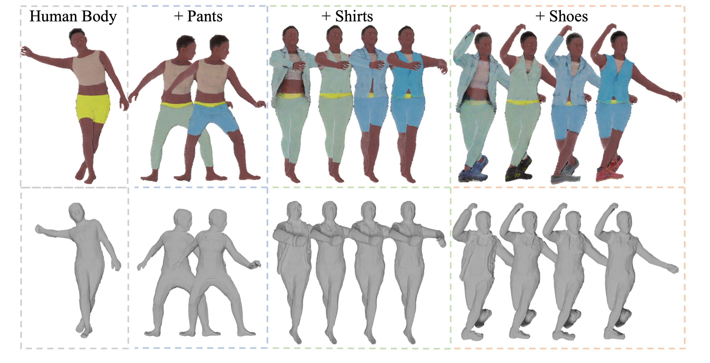

<div align="center">

<h1>HumanLiff: Layer-wise 3D Human Generation with Diffusion Model</h1>

<div>
    <a href="https://skhu101.github.io" target="_blank">Shoukang Hu<sup>1</sup></a>&emsp;
    <a href="https://hongfz16.github.io/" target="_blank">Fangzhou Hong<sup>1</sup></a>&emsp;
    <a href="https://scholar.google.com/citations?user=lSDISOcAAAAJ" target="_blank">Tao Hu<sup>1</sup></a>&emsp;
    <a href="http://www.cs.umd.edu/~taohu/" target="_blank">Liang Pan<sup>1</sup></a>&emsp;
    Haiyi Mei<sup>2</sup>&emsp;
    Weiye Xiao<sup>2</sup>&emsp;
    <a href="https://scholar.google.com.hk/citations?user=jZH2IPYAAAAJ&hl=en" target="_blank">Lei Yang<sup>2</sup></a>&emsp;
    <a href="https://liuziwei7.github.io/" target="_blank">Ziwei Liu<sup>1</sup>&emsp;
</div>
<div>
    <sup>1</sup>S-Lab, Nanyang Technological University&emsp; <sup>2</sup>Sensetime Research
</div>

<strong>HumanLiff learns layer-wise 3D human with a unified diffusion process.</strong>

<div style="width: 70%; text-align: center; margin:auto;">
    
    <em>Figure 1. HumanLiff learns to generate <strong>layer-wise 3D human with a unified diffusion process</strong>. Starting from a random noise, HumanLiff first generates a human body and then progressively generates 3D humans conditioned on previous generation. We use the same background color to denote generation results from the same human layer.</em>
</div>

:open_book: For more visual results, go checkout our <a href="https://skhu101.github.io/HumanLiff" target="_blank">project page</a>

This repository contains the official implementation of _HumanLiff: Layer-wise 3D Human Generation with Diffusion Model_.

<div align="left">

## :desktop_computer: Requirements
<!-- --- -->
NVIDIA GPUs are required for this project.
We recommend using anaconda to manage python environments.

```bash
    conda create --name humanliff python=3.8
    conda install pytorch==1.11.0 torchvision==0.12.0 torchaudio==0.11.0 cudatoolkit=11.3 -c pytorch
    conda install -c fvcore -c iopath -c conda-forge fvcore iopath
    conda install pytorch3d -c pytorch3d (or pip install --no-index --no-cache-dir pytorch3d -f https://dl.fbaipublicfiles.com/pytorch3d/packaging/wheels/py38_cu113_pyt1110/download.html)
    pip install -r requirements.txt
    conda activate sherf
```

## Set up Dataset
<!-- --- -->

#### Layer-wise SynBody Dataset
Please download our rendered multi-view images of layerwise SynBody dataset from [OneDrive]().

#### Layer-wise TightCap Dataset
Please download our rendered multi-view images of layerwise TightCap dataset from [OneDrive]().

#### Download Models
Register and download SMPL and SMPLX (version 1.0) models [here](https://smplify.is.tue.mpg.de/download.php). Put the downloaded models in the folder smpl_models. Only the neutral one is needed. The folder structure should look like

```
./
├── ...
└── recon_NeRF/assets/
    ├── SMPL_NEUTRAL.pkl
    ├── models/
        ├── smplx/
            ├── SMPLX_NEUTRAL.npz
```

```
./
├── ...
└── human_diffusion/assets/
    ├── SMPL_NEUTRAL.pkl
    ├── models/
        ├── smplx/
            ├── SMPLX_NEUTRAL.npz
```

## :train: Layer-wise Reconstruction
<!-- --- -->

```bash
cd recon_NeRF
```

### Reconstruction code with Layer-wise SynBody dataset

#### Optimize shared decoder with 100 subjects
```bash
python -m torch.distributed.launch --nproc_per_node 4 --master_port 12373 run_nerf_batch.py --config configs/SynBody.txt --data_root data/SynBody/20230423_layered/seq_000000 --expname SynBody_185_view_100_subject_triplane_256x256x27_tv_loss_1e-2_l1_loss_5e-4 --num_instance 100 --num_worker 3 --i_weights 50000 --i_testset 5000 --mlp_num 2 --batch_size 2 --n_samples 128 --n_importance 128 --views_num 185 --use_clamp --ddp 1 --lrate 5e-3 --tri_plane_lrate 1e-1 --triplane_dim 256 --triplane_ch 27 --tv_loss --tv_loss_coef 1e-2 --l1_loss_coef 5e-4
```

#### Optimize tri_plane parameters with fixed shared decoder for each subjec
```bash
python -m torch.distributed.launch --nproc_per_node 1 --master_port 12373 run_nerf_batch_ft.py --config configs/SynBody.txt --data_root data/SynBody/20230423_layered/seq_000000 --expname SynBody_185_view_100_subject_triplane_256x256x27_tv_loss_1e-2_l1_loss_5e-4 --num_instance 1 --num_worker 3 --i_weights 2000 --i_testset 8000 --mlp_num 2 --batch_size 8 --n_samples 128 --n_importance 128 --views_num 185 --use_clamp --ddp 1 --lrate 0 --tri_plane_lrate 1e-1 --ft_triplane_only --n_iteration 2000 --ft_path 200000.tar --multi_person 0 --start_idx 0 --end_idx 10 --triplane_dim 256 --triplane_ch 27 --start_dim 256 --tv_loss --tv_loss_coef 1e-2 --l1_loss_coef 5e-4
```
where start_idx and end_idx denote the start index and end index of subjects to be optimized.

#### Inference code
```bash
python -m torch.distributed.launch --nproc_per_node 1 --master_port 12373 run_nerf_batch.py --config configs/SynBody.txt --data_root data/SynBody/20230423_layered/seq_000000 --expname SynBody_185_view_100_subject_triplane_256x256x27_tv_loss_1e-2_l1_loss_5e-4 --num_instance 100 --num_worker 3 --i_weights 50000 --i_testset 5000 --mlp_num 2 --batch_size 1 --n_samples 128 --n_importance 128 --views_num 185 --use_clamp --ddp 1 --lrate 5e-3 --tri_plane_lrate 1e-1 --triplane_dim 256 --triplane_ch 27 --tv_loss --tv_loss_coef 1e-2 --l1_loss_coef 5e-4 --test --ft_path 200000.tar --test_layer_id 1
```
where test_layer_id denotes the layer index. 

### Reconstruction code with Layer-wise TightCap dataset

#### Optimize shared decoder with 100 subjects
```bash
python -m torch.distributed.launch --nproc_per_node 4 --master_port 12373 run_nerf_batch.py --config configs/TightCap.txt --data_root data/TightCap/f_c_10412256613 --expname TightCap_185_view_100_subject_triplane_256x256x27_tv_loss_1e-2_l1_loss_5e-4 --num_instance 100 --num_worker 3 --i_weights 50000 --i_testset 5000 --mlp_num 2 --batch_size 2 --n_samples 128 --n_importance 128 --views_num 185 --use_clamp --ddp 1 --use_canonical_space --lrate 5e-3 --tri_plane_lrate 1e-1 --triplane_dim 256 --triplane_ch 27 --tv_loss --tv_loss_coef 1e-2 --l1_loss_coef 5e-4
```

#### Optimize tri_plane parameters with fixed shared decoder for each subject
```bash
python -m torch.distributed.launch --nproc_per_node 1 --master_port 12373 run_nerf_batch_ft.py --config configs/TightCap.txt --data_root data/TightCap/f_c_10412256613 --expname TightCap_185_view_100_subject_triplane_256x256x27_tv_loss_1e-2_l1_loss_5e-4 --num_instance 1 --num_worker 3 --i_weights 2000 --i_testset 5000 --mlp_num 2 --batch_size 8 --n_samples 128 --n_importance 128 --views_num 185 --use_clamp --ddp 1 --use_canonical_space --lrate 0 --tri_plane_lrate 1e-1 --ft_triplane_only --n_iteration 2000  --ft_path 200000.tar --multi_person 0 --start_idx 0 --end_idx 10 --triplane_dim 256 --triplane_ch 27 --start_dim 256 --tv_loss --tv_loss_coef 1e-2 --l1_loss_coef 5e-4
```
where start_idx and end_idx denote the start index and end index of subjects to be optimized.

#### Inference code
```bash
python -m torch.distributed.launch --nproc_per_node 1 --master_port 12373 run_nerf_batch.py --config configs/TightCap.txt --data_root data/TightCap/f_c_10412256613 --expname TightCap_185_view_100_subject_triplane_256x256x27_tv_loss_1e-2_l1_loss_5e-4 --num_instance 100 --num_worker 3 --i_weights 50000 --i_testset 5000 --mlp_num 2 --batch_size 1 --n_samples 128 --n_importance 128 --views_num 185 --use_clamp --ddp 1 --use_canonical_space --lrate 5e-3 --tri_plane_lrate 1e-1 --triplane_dim 256 --triplane_ch 27 --tv_loss --tv_loss_coef 1e-2 --l1_loss_coef 5e-4 --test --ft_path 200000.tar --test_layer_id 1
```
where test_layer_id denotes the layer index. 

## :train: Layer-wise Generation 
<!-- --- -->

```bash
cd ../human_diffusion
```

### Generation code with Layer-wise SynBody dataset

#### Training
```bash
bash triplane_scripts/SynBody_triplane_train_layered_cond_controlnet_scale_256x256x27_tv_loss_nineplane.sh 1000 4 27 192 27 8 1000 200000
```

#### Inference
```bash
bash triplane_scripts/SynBody_triplane_sample_layered_cond_controlnet_scale_256x256x27_tv_loss_nineplane.sh 1000 27 192 27 0 12889
```

### Generation code with Layer-wise TightCap dataset

#### Training
```bash
bash triplane_scripts/TightCap_triplane_train_layered_cond_controlnet_scale_256x256x27_tv_loss_nineplane.sh 1000 4 27 192 27 8 107 200000
```

#### Inference
```bash
bash triplane_scripts/TightCap_triplane_sample_layered_cond_controlnet_scale_256x256x27_tv_loss_nineplane.sh 1000 27 192 27 0 12889
```

## :newspaper_roll: License

Distributed under the S-Lab License. See `LICENSE` for more information.


