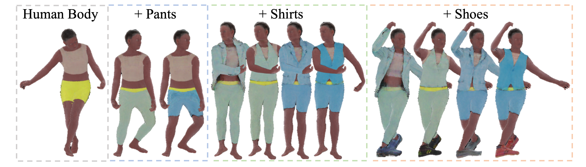

<h1>HumanLiff: Layer-wise 3D Human Generation with Diffusion Model</h1>

    <a href="https://skhu101.github.io" target="_blank">Shoukang Hu1</a>&emsp;
    <a href="https://hongfz16.github.io/" target="_blank">Fangzhou Hong1</a>&emsp;
    <a href="https://scholar.google.com/citations?user=lSDISOcAAAAJ" target="_blank">Tao Hu1</a>&emsp;
    <a href="http://www.cs.umd.edu/~taohu/" target="_blank">Liang Pan1</a>&emsp;
    Haiyi Mei2&emsp;
    Weiye Xiao2&emsp;
    <a href="https://scholar.google.com.hk/citations?user=jZH2IPYAAAAJ&hl=en" target="_blank">Lei Yang2</a>&emsp;
    <a href="https://liuziwei7.github.io/" target="_blank">Ziwei Liu1&emsp;

    1S-Lab, Nanyang Technological University&emsp; 2Sensetime Research

<strong>HumanLiff learns layer-wise 3D human with a unified diffusion process.</strong>

    
    <em>Figure 1. HumanLiff learns to generate <strong>layer-wise 3D human with a unified diffusion process</strong>. Starting from a random noise, HumanLiff first generates a human body and then progressively generates 3D humans conditioned on previous generation. We use the same background color to denote generation results from the same human layer.</em>

:open_book: For more visual results, go checkout our <a href="https://skhu101.github.io/HumanLiff" target="_blank">project page</a>

This repository will contain the official implementation of _SHERF: Generalizable Human NeRF from a Single Image_.

## :newspaper_roll: License

Distributed under the S-Lab License. See `LICENSE` for more information.

